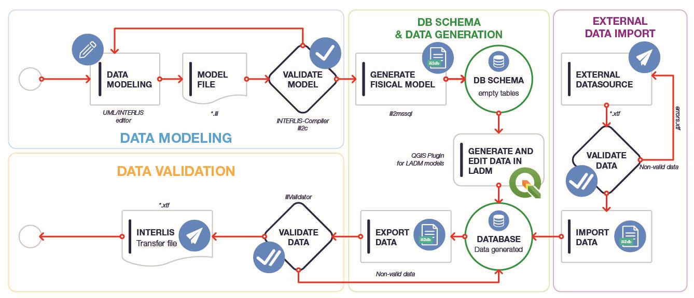

# <!--fit-->What is INTERLIS?
--- 

- INTER Land Information Systems
- A data description language with special consideration of **geodata**
- Object oriented and extendable
- System neutral (platform independent)
- Readable by humans and machines
- Model driven approach

<!-- [INTERLIS](https://www.interlis.ch/) (INTER Land Information Systems) is a data description language and a transfer format with special consideration of geodata. INTERLIS offers the possibility to describe spatial data precisely, to integrate them in conformity with the model and to exchange them easily among different users. INTERLIS has been bindingly anchored in Swiss geoinformation legislation since 2008. Since INTERLIS has been object-oriented since version 2, it can be extended very easily. This means that, for example, the federal government defines a model that the cantonal authorities can derive and extend according to their needs. 

- Supports Geometries
- Since version 2 object oriented - perfect for data exchange between authorities. This is important since it's anchored in Swiss geoinformation legislation since 2008 to use INTERLIS.
- Perfect for the discussion between ITs and thematic specialists
- Strict division between the transfer part and the modeling part
-->
--- 
## Model file and transfer data file

The model is defined in INTERLIS language and stored in an `.ili` file.

The data is in xml (considering the model) and stored as an `.xtf` file (former `.itf`).

---

# <!--fit--> INTERLIS Modelling in 10 Minutes

--- 

## Beispiel Staudamm Inventar


---

## Staudamm

- Name
- Baujahr
- Bauweise (z.B. Bogenstaumauer, Gewichtmauer, ...)
- Höhe
- Reservoire grösse
- Letzte sanierung
- Lage
- Detailgeometrie


---

## Staudamm in INTERLIS

Bund Modell
```
INTERLIS 2.3;
IMPORTS Units;
CLASS Staudamm =
  name: MANDATORY TEXT*80;
  baujahr: 1000..3000;
  bauweise: (Bogenstaumauer, Gewichtmauer, Pfeilermauer);
  hoehe: 1..400 [Units.Meter];
  letzte_sanierung: 1000..3000;
  lage: GeometryCHLV95_V1.Coord2;
  detailgeometrie: SURFACE WITH (STRAIGHTS) VERTEX GeometryCHLV95_V1.Coord2
END Staudamm;
```

---

## Extended model

Kanton Modell
```
CLASS StaudammCanton EXTENDS Staudamm =
    letzte_inspektion: INTERLIS.Date;
    zustand: (gut,schlecht);
END StaudammCanton;
```

---

## Extended model

Ingenieur Büro modell:
```
CLASS Inspektor =
    name: TEXT*80;
END Inspektor;

CLASS StaudammLocal EXTENDS StaudammCanton =
    inspektor: Inspektor;
END StaudammLocal;

ASSOCIATION = 
    StaudammLocal -- {1} StaudammLocal
    Inspektor -- {*} Inspektor
END;
```

---

## Have a look at a simple model
[Buildings](./assets/demo_models/super_simple_buildings_V1.ili)


---
# <!--fit-->  INTERLIS implementation workflow and tools
---


(Graphic by landnetwork.ch)

---

## Compiler ili2c

The INTERLIS Compiler checks an INTERLIS model if the constructs of the language INTERLIS were applied correctly. It reports syntactic errors in the model with the line number so that they can be corrected by the modeler.

---
## ili2fme and ili2db
ili2pg, ili2gpkg and ili2fgdb are programs that write an INTERLIS transfer file according to an INTERLIS model into a database (PostgrSQL/PostGIS, GeoPackage or ESRI FileGDB) or create such a transfer file from a database.

---
## ilivalidator
The ilivalidator tool checks whether data in the INTERLIS 1 and 2 transfer format (*.itf/*.xtf)  complies with the associated model (*.ili). License terms and further information about the ilivalidator can be found here.

---
# <!--fit-->  Swiss geodata repositories

---
## ilimodels.xml
- Based on the model `IliRepository09`
- Contains objects of the class `ModelMetadata` where a model name and a file path is defined
- The files are on the same repository

---

## ilisites.xml

- Based on the model `IliSite09`
- Contains objects of the class `SiteMetadata` where path to other repositories are defined
http://models.interlis.ch/ilisite.xml -> http://models.geo.kgk-cgc.ch/ilisite.xml -> http://models.geo.sh.ch/ilisite.xml

[*Let's have a look*](http://models.interlis.ch/)

---

# <!--fit--> 🧁 QGIS MODEL BAKER 

---
# <!--fit--> What is MODEL BAKER?

---
## A QGIS Project Generator

Quickly **creates a QGIS project** from a physical data model. 

Analyzes the existing structure and configures a QGIS project with all available information. 

---

## A QGIS Project Generator optimized for INTERLIS

Models defined in INTERLIS provide **additional meta information** like domains, units of attributes or object oriented definitions of tables.

This can be used to further optimize the project configuration. 

<!-- Model Baker can use the meta information to configure layer tree, field widgets with conditions, form layouts, relations and much more.-->

---

## An ili2db controll station

```
java -jar /home/dave/dev/opengisch/QgisModelBaker/QgisModelBaker/libili2db/bin/ili2pg-4.6.1/ili2pg-4.6.1.jar --schemaimport --dbhost localhost --dbport 5432 
--dbusr postgres --dbpwd ****** --dbdatabase bakery --dbschema adsfdsaf2 --setupPgExt --coalesceCatalogueRef --createEnumTabs --createNumChecks --createUnique 
--createFk --createFkIdx --coalesceMultiSurface --coalesceMultiLine --coalesceMultiPoint --coalesceArray --beautifyEnumDispName --createGeomIdx --createMetaInfo 
--expandMultilingual --createTypeConstraint --createEnumTabsWithId --createTidCol --importTid --smart2Inheritance --strokeArcs --defaultSrsCode 2056 
--models Wildruhezonen_LV95_V2_1
```

<!-- It provides the user only the needed settings to pass parameters to the ili2db.
Creates the commando for ili2db.
-->

---
## And it's a library

Can be used as a framework.

Like [Asistente LADM-COL](https://github.com/SwissTierrasColombia/Asistente-LADM-COL), created for the [Colombian implementation of the Land Administration Domain Model (LADM)](https://www.proadmintierra.info/) does it.

<!--
Model Baker can be used as a framework for other projects. The plugin [Asistente LADM-COL](https://github.com/SwissTierrasColombia/Asistente-LADM-COL), created for the [Colombian implementation of the Land Administration Domain Model (LADM)](https://www.proadmintierra.info/), uses the Model Baker as a library to implement as much of the specific solution as possible as QGIS core functionality.
-->
---
## <!--fit--> Check it out now

<!--
- super_simple_buildings to GPKG
- Wildruhezonen_V2_1.ili, wrz_bundesmodell.xtf, Wildruhezonen_Catalogues_V2_1.xml to Postgres
- show with Repo Wildruhezonen_LV95_V2_1 as well receiving the catalgue from repo to Postgres
- show with usabilityhub
- show with only having the xtf as source
- Import everything
- Show validation and export
-->
---
# What is the UsabILIty Hub?
Receive meta data like ***ili2db settings***, ***layer styles*** and ***orders*** etc. automatically over the web. 

See https://usabilityhub.opengis.ch/
---

## Metaconfiguration and Toppings
Get the additional information with the `ilidata.xml` file on the UsabILIty Hub (currently https://models.opengis.ch) and the linked repositories. 

Model baker homepage: https://opengisch.github.io/QgisModelBaker/